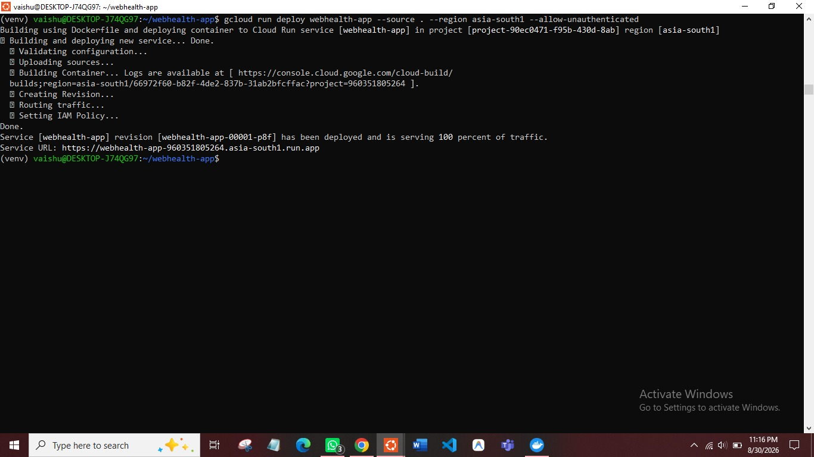
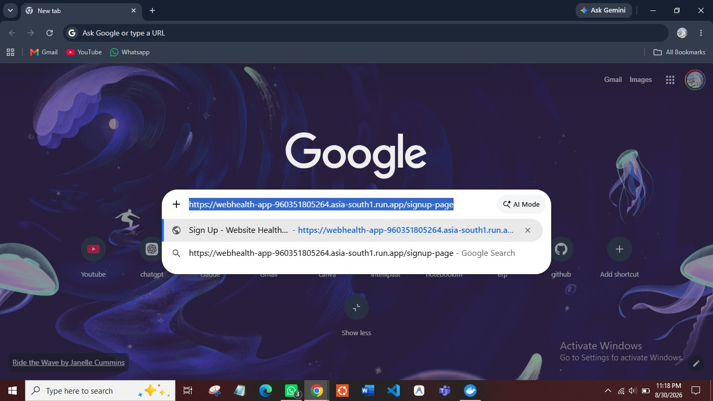
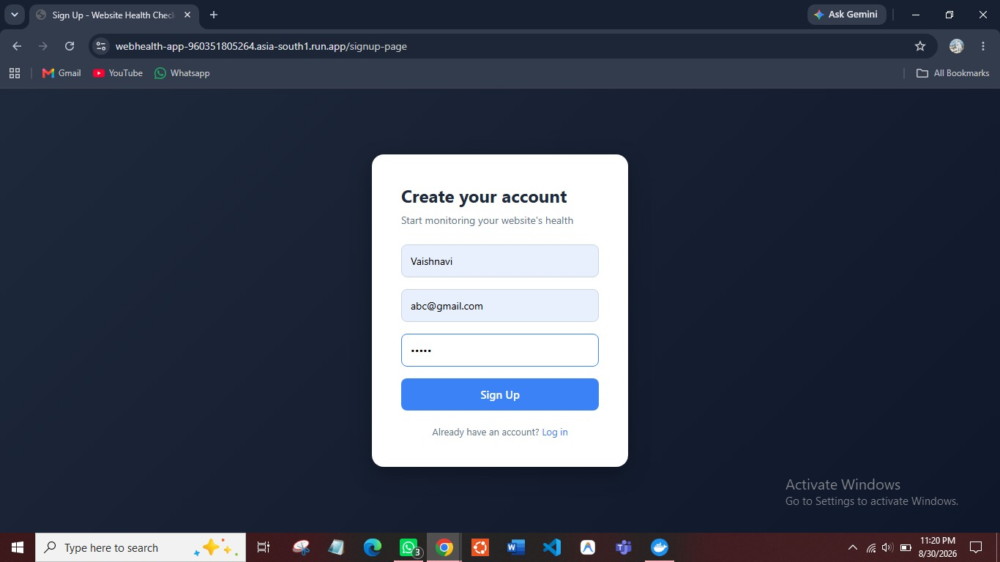
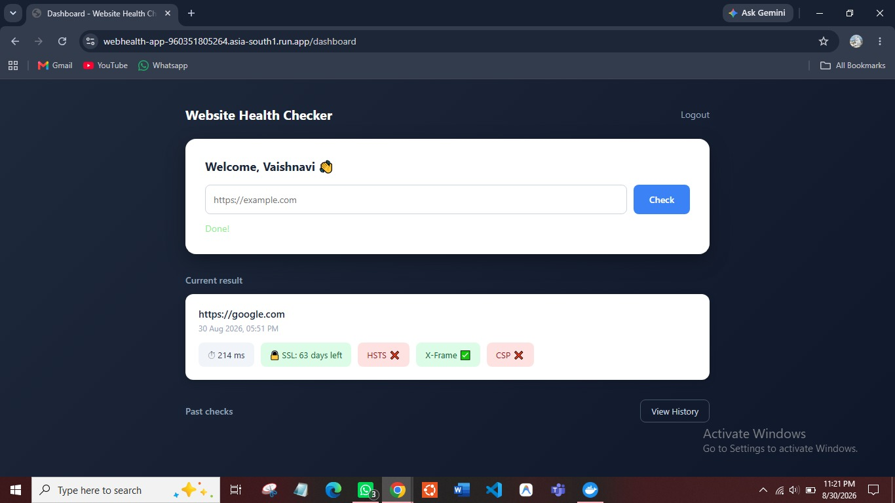
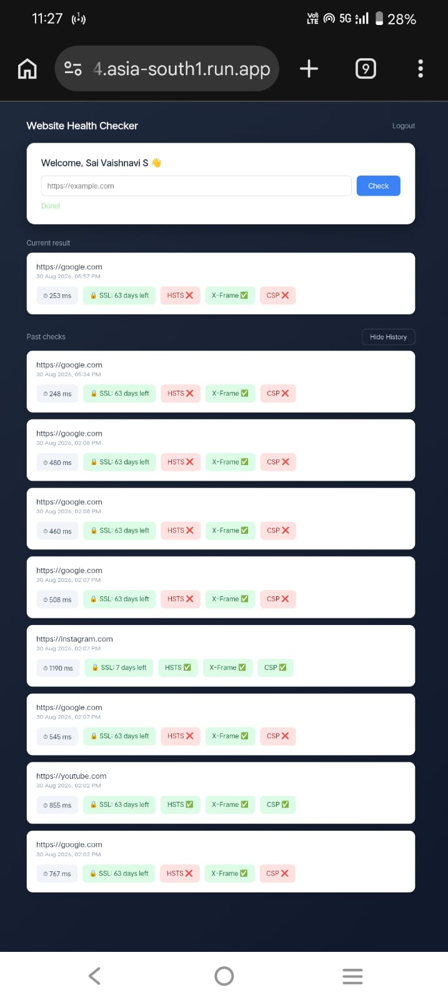

# Website Health Checker

A full-stack Flask web app that checks a website's SSL certificate expiry, security headers, and response time — with user authentication and a live dashboard to track check history.

**Live demo:** https://webhealth-app-960351805264.asia-south1.run.app

## Features

- Checks SSL certificate expiry, HSTS/X-Frame-Options/CSP security headers, and response time for any URL
- User signup and login with hashed passwords (Flask-Bcrypt)
- Dashboard showing the current check result plus a history of past checks per user
- Session-based authentication

## Tech Stack

- **Backend:** Python, Flask, Flask-SQLAlchemy
- **Database:** SQLite
- **Frontend:** HTML, CSS, vanilla JavaScript (fetch API)
- **Deployment:** Docker, Google Cloud Run

## Architecture

Browser → Flask app (Gunicorn) → SQLite database
↓
SSL / headers / response-time checks (Python ssl, socket, requests)


The app is containerized with Docker and deployed on Google Cloud Run, a serverless platform that runs the container on demand.

## Running Locally

```bash
git clone https://github.com/saivaishnavi30/webhealth-app.git
cd webhealth-app
python3 -m venv venv
source venv/bin/activate
pip install -r requirements.txt
flask run
```

Visit: `http://127.0.0.1:5000/signup-page`

## Running with Docker

```bash
docker build -t webhealth-app .
docker run -p 8080:8080 webhealth-app
```

## What I Learned

Building this project took me through the full path from a bare Python script to a deployed cloud product — writing backend logic, adding a database and authentication, building a frontend that talks to the backend via JavaScript, containerizing the app with Docker, and deploying it to Google Cloud Run.


## Screenshots

**Terminal — successful deployment to Cloud Run**
Shows the app being deployed via `gcloud run deploy`, confirming it's live and serving traffic.



**Live URL running in the browser**
The deployed Cloud Run URL, proving the app is publicly hosted and not running on localhost.



**Signup page**
Users create an account with name, email, and password (hashed with bcrypt before storing).



**Dashboard — health check result**
After entering a URL, the dashboard shows SSL certificate expiry, response time, and security header checks in real time.



**Dashboard — mobile view with history**
The dashboard is responsive and also displays a user's past checks in the history section.


